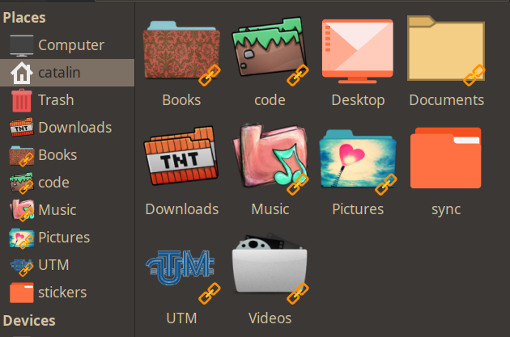

# thunar folder thumbnail

## dependencies
- thunar ( at least it doesn't work with pcmanfm and dolphin)
- tumbler  
- imagemagick  

## usage 
- install:  
	./install.sh  

- use custom folder icons:  
	place a ".folder.png" image in any folder  

- to add a thunar menu (kinda, and depends on sxiv)  
	./icons.sh  
	- and cant uninstall this

- uninstall:  
	 ./uninstall.sh  

[source](https://forums.linuxmint.com/viewtopic.php?t=323757)
